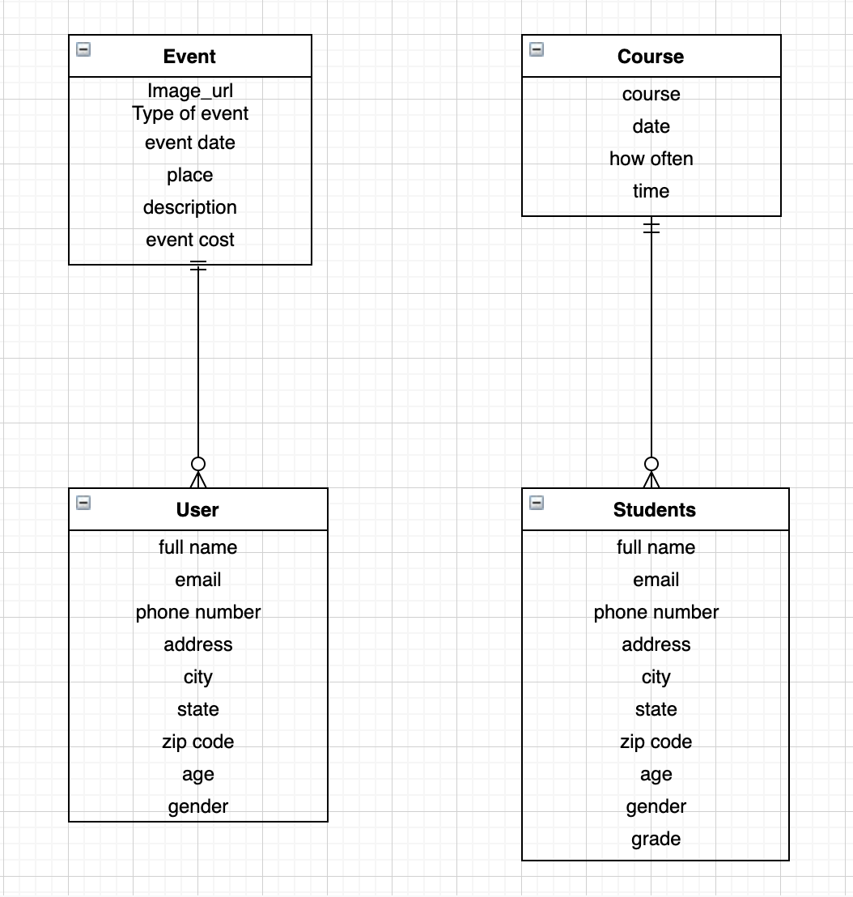
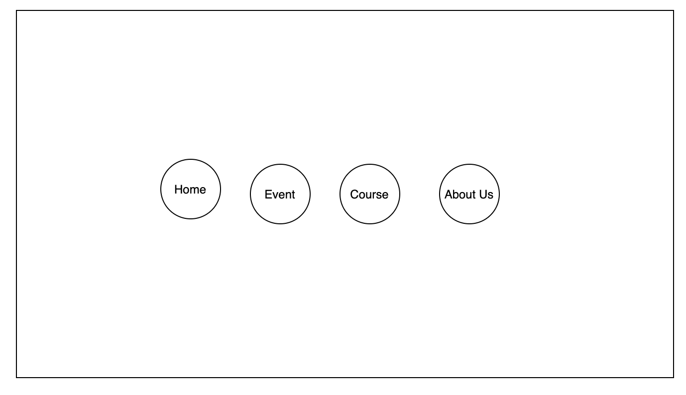
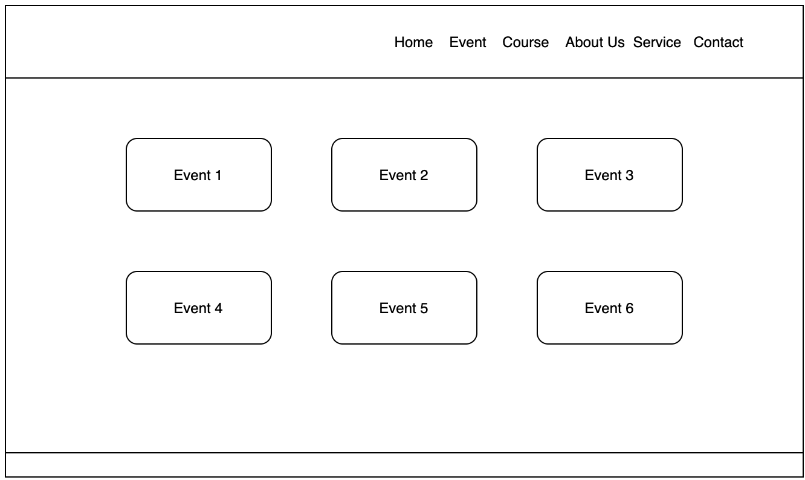
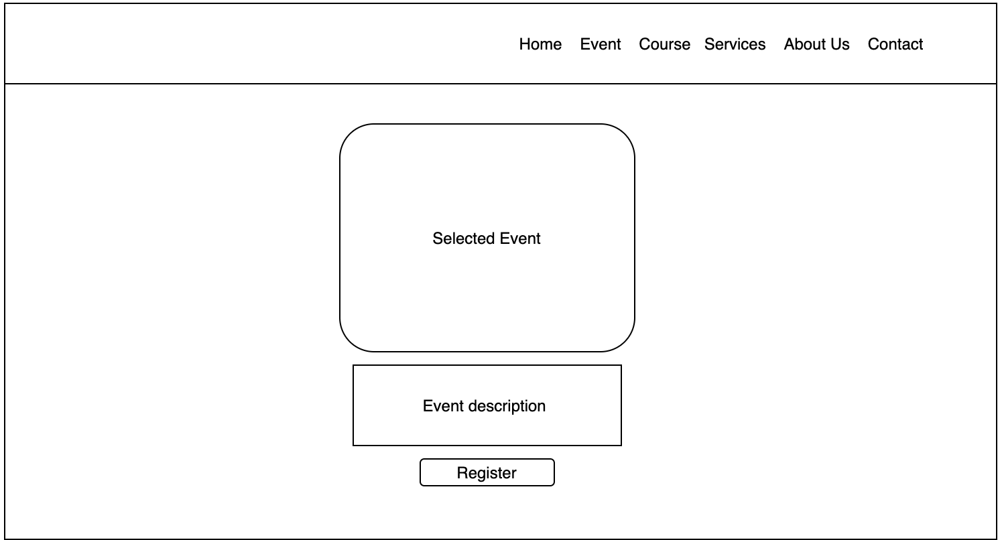
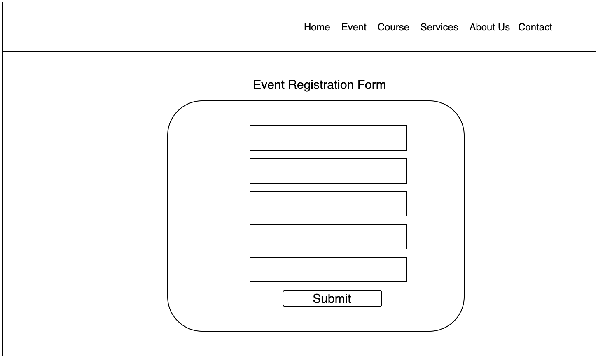
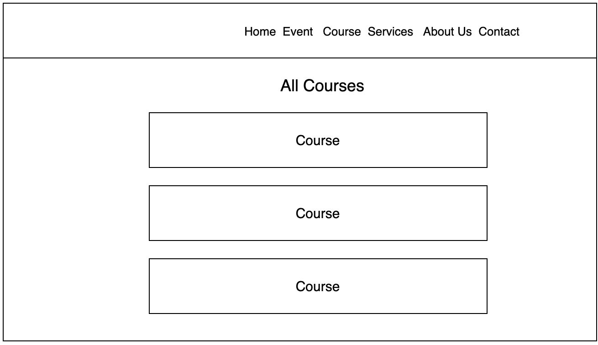
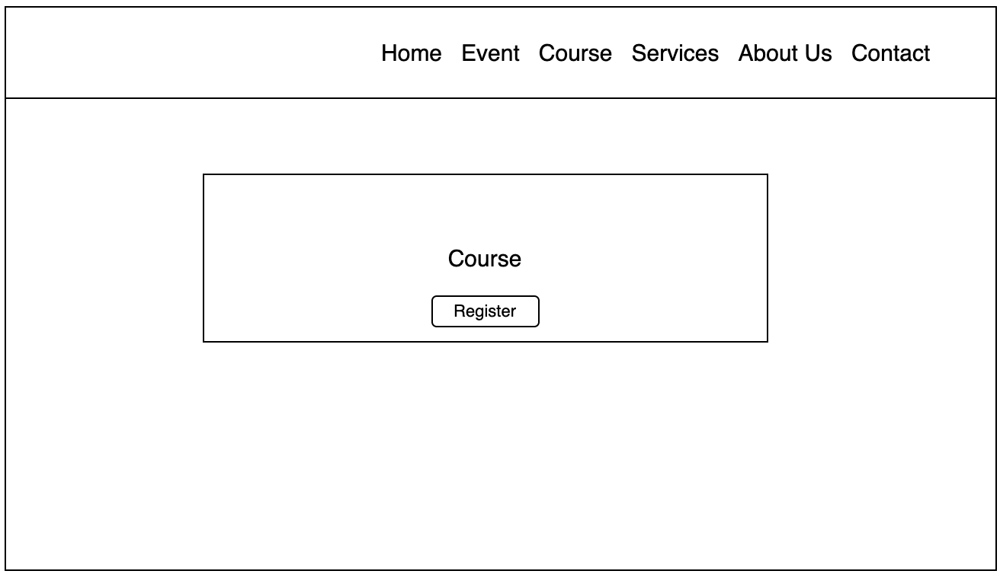
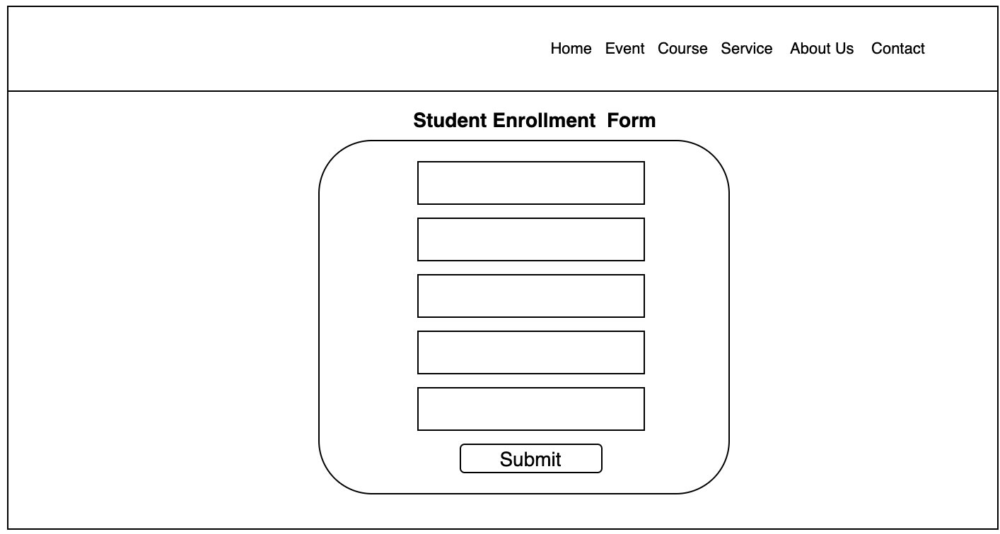

# Debre Tsion Web App
 I always want to build a fully interactive website to my church. I'm taking this opportuniuty to do that. The purpose of this app is to organize the people who are registering to Sunday school classes and different events or activities. 

 # User Stories
 * User can see different kinds events and activities.
 * User can select event and register.
 * Students can see all the classes that the church offers and events.
 * Students can select class and register.
 * Students can select event and register.

 # ERD
 

 # Wireframe
 * Home page

  

    

    

    

    

    

 
 # Publicly Deployed App
 Click [here](https://mount-tsion-app.herokuapp.com/admin/) to visit the app.
# Prject Planning Board
Click [here](https://github.com/sophiemar27/my-church-web-app/projects/1) to see project planning board.